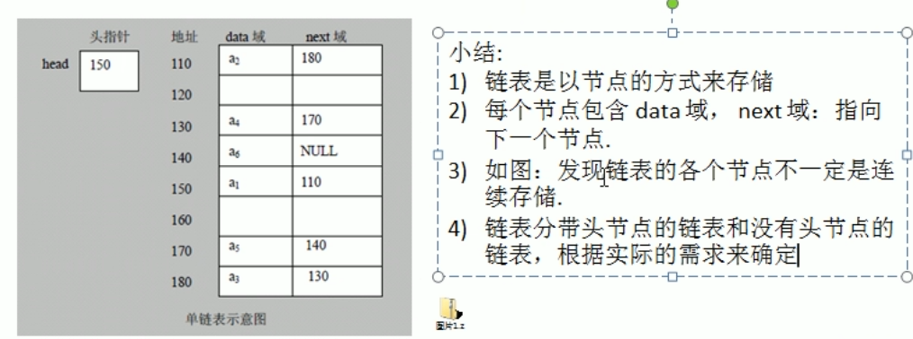

# 数据结构与算法笔记

## 分类

数据结构分为线性和非线性结构

1. 常见的线性结构：数组、队列、链表和栈

   线性结构存储结构：顺序存储结构（数组）和链式存储结构（链表）

   

2. 非线性结构包括：二位数组、多维数组、广义表、**树结构、图结构**


## 稀疏（sparsearray）数组和队列

### 稀疏数组

介绍：当一个数组中大部分元素为0，i或者为同一个值的数组时，可以使用稀疏数组来保存该数组。

处理方法：

1. 记录数组一共有几行几列，有多少个不同值

2. 把具有不同值元素的行列以及值记录在小规模数组中，从而缩小程序的规模

   

### 队列

- 队列是一个有序列表，可以用数组或者链表实现

- 遵循先入先出的原则

  -----

1. **数组实现**

   

   ```java
   /**
    * @author Fish
    * @version 1.0
    */
   public class duilie {
   }
   
   //使用数组模拟队列-编写一个ArrayQueue类
   class ArrayQueue {
       private int maxSize;// 表示数组的最大容量
       private int front; //队列头
       private int rear; //队列尾
       private int[] arr;// 该数据用于存放数据，模拟队列
   
       //创建队列的构造器
       public ArrayQueue(int arrMaxSize) {
           maxSize = arrMaxSize;
           arr = new int[maxSize];
           front = -1;//指向队列头部，分析出front是指向队列头的前一个位置
           rear = -1;//指向队列尾，指向队列尾的数据（即就是对队列最后一个数据）
       }
   
       //判断队列是否满
       public boolean isFull() {
           return rear == maxSize - 1;
       }
   
       //判断队列是否为空
       public boolean isEmpty() {
           return rear == front;
       }
   
       //添加数据到队列
       public void addQueue(int n) {
           //判断队列是否满
           if (isFull()) {
               System.out.println("队列满，不能加入数据~");
               return;
           }
           rear++;//让rear 后移
           arr[rear] = n;
       }
   
       //获取队首的数据并出队列
       public int getQueue() {
           //判断队列是否空
           if (isEmpty()) {
               //通过抛出异常
               throw new RuntimeException("队列空，不能职数据");
           }
           front++;//front后移
           return arr[front];
       }
       
       //显示队列的所有数据
       public void showQueue() {
           //遍历
           if (isEmpty()) {
               System.out.println("队列空的，没有数据~~");
               return;
           }
           for (int i = 0; i < arr.length; i++) {
               System.out.printf("arr[%d]=%d\n", i, arr[i]);
           }
       }
   }
   ```

   问题：

   - 数组不能重复使用

   - 将这个数组使用算法改进成一个环形的队列 取模%

   **数组模拟环形队列**

   - front变量的含义做一个调整:front就指向队列的第一个元素,也就是说[front]就是队列的第一个元素
   - front的初始值=0
   - rear 变量的含义做一个调整:rear指向队列的最后一个元素的后一个位做为约定rear ，**为了算法方便留了一个预留空间**，初始值=0
   - 当队列满时，条件是(rear +1)%maxsize=front【满】
   - 对队列为空的条件，rear==front空
   - 当我们这样分析，队列中有效的数据的个数(rear+maxsize-front)%maxSize          //rear=1 front=0
   - 我们就可以在原来的队列上修改得到，一个环形队列


## 链表Linked lists

链表是有序的列表，在内存中存储如下

### 单向链表




**单项链表常见面试题**


### 双向链表

 **单向链表的缺点**

1. 查找方向只能是一个方向
2. 单向链表不能自我删除，需要依靠辅助节点，而双向链表可以实现自我删除


### 单向环形链表

应用场景：Josephu（约瑟夫，约瑟夫环）问题


### 栈


